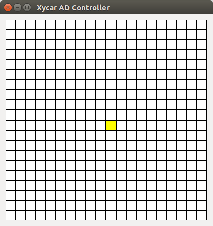
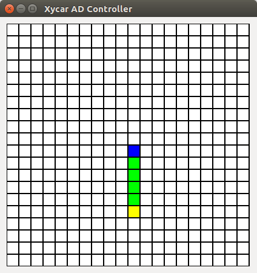
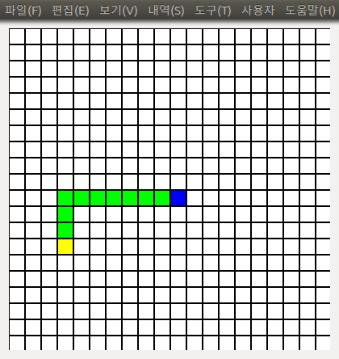
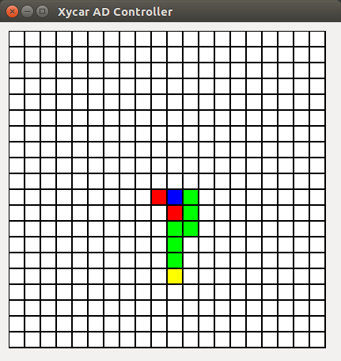
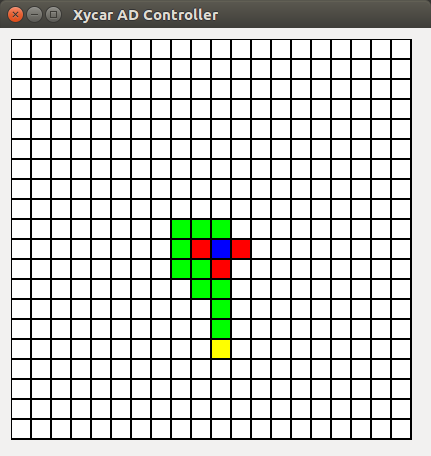

# Disaster-response-Xycar
Disaster response Xycar is disaster response robot that made out of Xycar.

## 창업연계공학설계입문 AD Project

### 1. Team Infos

* 팀명: 5조
* 팀 멤버

| 이름   | 학번     |
|--------|----------|
| 윤상건 | 20191632 |
| 이민재 | 20191638 |
| 이연주 | 20191644 |
| 김인규 | 20150752 |

### 2. About This Project

* 목표: 도로를 인식할 수 없는 상황에서 Xycar가 장애물(Stop sign)을 인식하고 사용자가 설정한 목적지까지 장애물을 피해 이동할 수 있는 경로를 계산하여 자율주행하도록 한다.

* 제약사항: Xycar의 IMU센서를 이용하여 정밀한 위치를 계산할 계획이었지만, IMU센서가 켈리브레이션 되어 있지 않아 IMU센서의 데이터를 사용할 수 없었다. 따라서 각 위치를 일정 크기의 Grid로 표현하여 위치를 파악하는 것으로 축소하였다.

* 목표 달성을 위한 구현 내용
  * Xycar의 90도 회전 연산: 그리드 구조에서 방향 전환을 위해 제자리 90도 회전을 구현했다.
  * Xycar의 전진 연산: 그리드 구조에서 원하는 그리드로 이동하기 위한 전진 기능을 구현했다.
  * YOLOv3를 이용한 사물인식 연산: Xycar의 카메라에서 받은 이미지에서 정지 표지판을 인식하기 위해 YOLO를 이용한 사물 인식을 구현했다.
  * 경로 계산 연산: 그리드 구조에서 목적지까지 이동 경로를 계산하기 위한 경로 계산 알고리즘을 BFS 알고리즘을 이용하여 구현했다.

### 3. ROS 구조

#### 3.1. 노드 구조

Xycar에서 실행되는 ROS패키지에 대한 코드는 `xycar_side`에 포함되어 있고, Xycar에 원격으로 접속하는 컴퓨터에서 실행되는 노드는 `remote_side`에 포함되어 있다.

실행시 노드 구조는 다음과 같다.


토픽을 포함한 자세한 구조는 다음과 같다.


#### 3.2. 각 노드의 역할

##### 3.2.1. Xycar부분에서 실행되는 노드
* `xycar_driver`: 자율주행 수행 노드
* `xycar_ad_controller`: Xycar이동 경로 및 이동 명령 창 출력 노드
* `motor_control`: 모터 제어 노드
* `ultrasonic`: 초음파 센서 수신 노드
* `usb_cam`: usb camera에서 영상 데이터 수신 노드

##### 3.2.2 Remote부분에서 실행되는 노드
* `xycar_remote`: YOLOv3를 이용한 사물인식 노드

#### 3.3. 각 토픽의 역할

* `/xycar_ad/controller_msg`: 경로를 포함한 지도 정보를 전달
* `/xycar_ad_controller/controller_msg`: 사용자가 목적지를 설정한 정보를 전달
* `/remote_rec`: xycar가 촬영한 이미지 정보 전달
* `/remote_pub`: YOLOv3가 판단한 사물 인식 정보 전달
* `/xycar_motor_msg`: 모터 제어 정보 전달
* `/ultrasonic`: 초음파 센서 정보 전달
* `/usb_cam/image_raw`: usb camera가 촬영한 이미지 정보 

### 3.4. 각 모듈의 역할

* Remote 부분
 * `xycar_ad_remote.py`: `/remote_rec`토픽으로 부터 이미지 데이터를 받아 YOLO를 수행하고 결과를 `/remote_pub`토픽으로 발행하는 모듈
 * `yolo.py`: 이미지 데이터를 입력받고 인식 결과를 표준출력으로 출력하는 모듈
* Xycar 부분
 * `xycar_driver` 노드
  * `autodrive.py`: YOLO인식 결과인 `/remote_pub`토픽과 사용자가 입력한 목적지 정보인 `/xycar_ad_controller/controller_msg`토픽으로 부터 정보를 받고 `shortest_path` 모듈로 부터 계산된 경로를 바탕으로 자율주행을 수행하는 모듈
  * `camimage.py`: `/usb_cam/image_raw`토픽에서 카메라가 촬영한 이미지를 받아오는 모듈
  * `imuread.py`: IMU센서 데이터를 가져오는 모듈 (IMU센서의 문제로 사용하지 않음)
  * `motordriver.py`: `/xycar_motor_msg`토픽으로 모터 제어 정보를 발행하는 모듈
  * `shortest_path.py`: 현재 위치, 장애물 정보, 목적 위치를 관리하고 최단 경로를 계산하는 모듈
 * `xycar_ad_controller` 노드
  * `controller.py`: 현재 xycar의 위치와 앞으로의 경로를 출력하고 사용자로 부터 목적지를 명령받는 PyQt를 이용한 GUI창 출력하는 

### 4. 실행시 모습

#### 4.1 Xycar의 경로 및 목적지를 설정하는 창

각 색이 의미하는 것은 다음과 같다.
* 파랑색: Xycar의 현재 지점
* 초록색: 계산한 경로
* 노랑색: 사용자가 설정한 목적지
* 빨간색: Xycar가 탐지한 장애물

* 실행 직후 화면



* 목적지 설정 직후 화면1



* 목적지 설정 직후 화면2



* 장애물 탐지 직후 화면1



* 장애물 탐지 직후 화면2




### 5. 실행 방법

#### 5.1. 코드 설정
* Remote 부분

Remote 부분의 `xycar_ad_remote.py` 코드의 `RemoteXycar`클래스에 정의되어 있는 `yolo_path`의 경로를 실행자의 환경에 맞게 수정해 준다. 해당 변수에는 YOLO의 위치가 들어간다.

YOLO를 이용한 사물인식을 담당하는 `yolo.py` 또한 경로를 절대경로로 수정해 주는 것이 좋다. 만약 절대경로로 수정하지 않은 경우, 터미널의 경로를 `yolo.py`가 존재하는 위치로 해두면 된다.

#### 5.2. ROS 환경변수 설정
* Remote 부분

Remote부분(Xycar에 접속하는 컴퓨터)의 터미널에서 다음과 같이 환경변수를 설정한다.
```
export ROS_IP={Remote의 IP}
export ROS_MASTER_URI=http://10.42.0.1:11311/
```

Remote에서 Xycar로 토픽 메시지를 전송하기 위해 다음과 같이 방화벽을 비활성화 해준다.
```
sudo ufw disable
```

만약 Remote에서 package를 찾을 수 없다는 에러가 발생할 경우 다음의 코드를 Workspace 디렉토리에서 다음의 명령어를 입력해준다.
```
source devel setup.bash
```

* Xycar 부분

Xycar 터미널에서 다음과 같이 환경변수를 설정한다.
```
export ROS_HOSTNAME=10.42.0.1
```

#### 5.3. ROS 노드 실행 방법

* Remote 부분

Remote부분에서 다음과 같이 사물 인식을 위한 노드를 실행한다.
```
rosrun xycar_ad_remote xycar_ad_remote.py
```

* Xycar 부분

Xycar부분에서 다음과 같이 패키지를 실행한다.
```
roslaunch xycar_ad xycar_ad.launch
```
