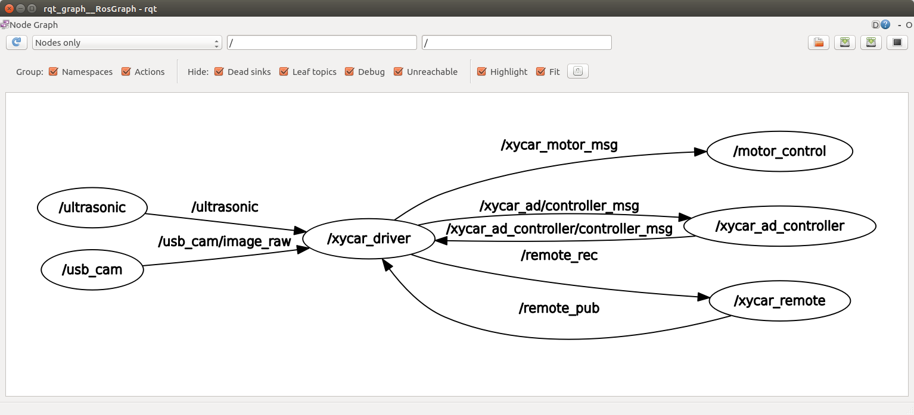
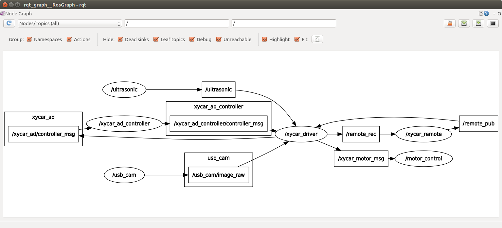

# Disaster-response-Xycar
Disaster response Xycar is disaster response robot that made out of Xycar.

## 창업연계공학설계입문 AD Project

### Team Infos

* 팀명: 5조
* 팀 멤버

| 이름   | 학번     |
|--------|----------|
| 윤상건 | 20191632 |
| 이민재 | 20191638 |
| 이연주 | 20191644 |
| 김인규 | 20150752 |

### About This Project

* 목표: 도로를 인식할 수 없는 상황에서 Xycar가 장애물(Stop sign)을 인식하고 사용자가 설정한 목적지까지 장애물을 피해 이동할 수 있는 경로를 계산하여 자율주행하도록 한다.

### ROS 구조

#### 노드 구조

Xycar에서 실행되는 ROS패키지에 대한 코드는 `xycar_side`에 포함되어 있고, Xycar에 원격으로 접속하는 컴퓨터에서 실행되는 노드는 `remote_side`에 포함되어 있다.

실행시 노드 구조는 다음과 같다.



토픽을 포함한 자세한 구조는 다음과 같다.



#### 각 노드의 역할

##### Xycar부분에서 실행되는 노드
* `xycar_driver`: 자율주행 수행 노드
* `xycar_ad_controller`: Xycar이동 경로 및 이동 명령 창 출력 노드
* `motor_control`: 모터 제어 노드
* `ultrasonic`: 초음파 센서 수신 노드
* `usb_cam`: usb camera에서 영상 데이터 수신 노드

##### Remote부분에서 실행되는 노드
* `xycar_remote`: YOLOv3를 이용한 사물인식 노드

#### 각 토픽의 역할

* `/xycar_ad/controller_msg`: 경로를 포함한 지도 정보를 전달
* `/xycar_ad_controller/controller_msg`: 사용자가 목적지를 설정한 정보를 전달
* `/remote_rec`: xycar가 촬영한 이미지 정보 전달
* `/remote_pub`: YOLOv3가 판단한 사물 인식 정보 전달
* `/xycar_motor_msg`: 모터 제어 정보 전달
* `/ultrasonic`: 초음파 센서 정보 전달
* `/usb_cam/image_raw`: usb camera가 촬영한 이미지 정보 

### 

### 실행 방법

#### 코드 설정
* Remote 부분

Remote 부분의 `xycar_ad_remote.py` 코드의 `RemoteXycar`클래스에 정의되어 있는 `yolo_path`의 경로를 실행자의 환경에 맞게 수정해 준다. 해당 변수에는 YOLO의 위치가 들어간다.

YOLO를 이용한 사물인식을 담당하는 `yolo.py` 또한 경로를 절대경로로 수정해 주는 것이 좋다. 만약 절대경로로 수정하지 않은 경우, 터미널의 경로를 `yolo.py`가 존재하는 위치로 해두면 된다.

#### ROS 환경변수 설정
* Remote 부분

Remote부분(Xycar에 접속하는 컴퓨터)의 터미널에서 다음과 같이 환경변수를 설정한다.
```
export ROS_IP={Remote의 IP}
export ROS_MASTER_URI=http://10.42.0.1:11311/
```

Remote에서 Xycar로 토픽 메시지를 전송하기 위해 다음과 같이 방화벽을 비활성화 해준다.
```
sudo ufw disable
```

만약 Remote에서 package를 찾을 수 없다는 에러가 발생할 경우 다음의 코드를 Workspace 디렉토리에서 다음의 명령어를 입력해준다.
```
source devel setup.bash
```

* Xycar 부분

Xycar 터미널에서 다음과 같이 환경변수를 설정한다.
```
export ROS_HOSTNAME=10.42.0.1
```

#### ROS 노드 실행 방법

* Remote 부분

Remote부분에서 다음과 같이 사물 인식을 위한 노드를 실행한다.
```
rosrun xycar_ad_remote xycar_ad_remote.py
```

* Xycar 부분

Xycar부분에서 다음과 같이 패키지를 실행한다.
```
roslaunch xycar_ad xycar_ad.launch
```
